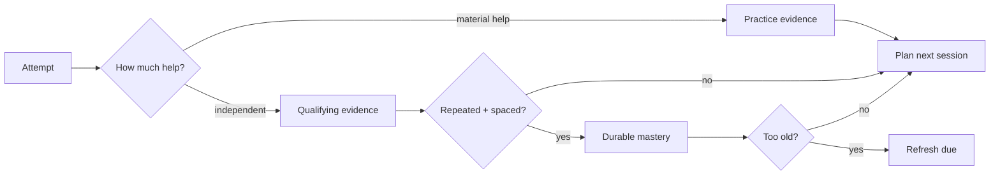

# Learning Evidence Core

**Watching three tutorials is not a black belt.**

This repo is a public, sanitized slice of the evidence logic behind my Learning OS work. The core idea is boring on purpose: practice is useful, help is useful, projects are useful — but none of them should quietly masquerade as independent mastery.

## Flow



The system is allowed to say: *“Nice work. That was assisted, so it counts as practice.”*

That is more useful than handing out imaginary XP until the dashboard looks confident.

## What this proves

- assisted practice and independent evidence are separate;
- project completion does not auto-promote prerequisite skills;
- mastery requires repeated independent evidence;
- durable evidence needs spacing;
- old mastery can become refresh-due without pretending it was never learned.

## Run

```bash
PYTHONPATH=src python -m unittest discover -s tests
```

## Boundary

No private learner history, voice recordings, provider keys, browser storage, or personal course data is included.

## Provenance

Rewritten from the evidence/mastery rules used in my private Learning OS repository and its recent RS-1 / AI / pointer-learning work.
