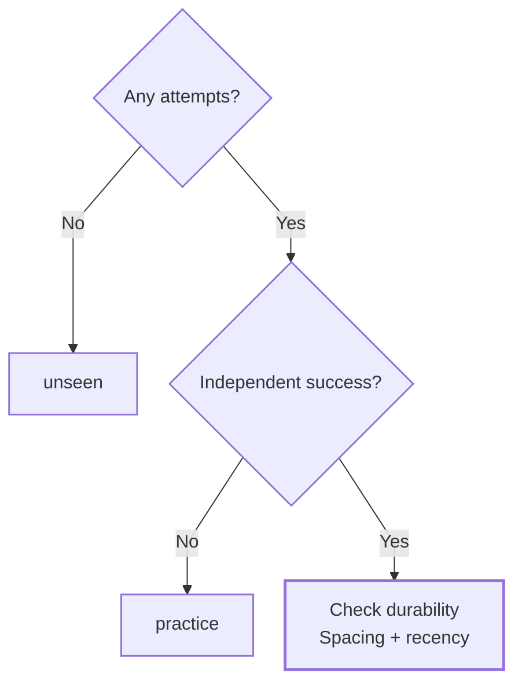
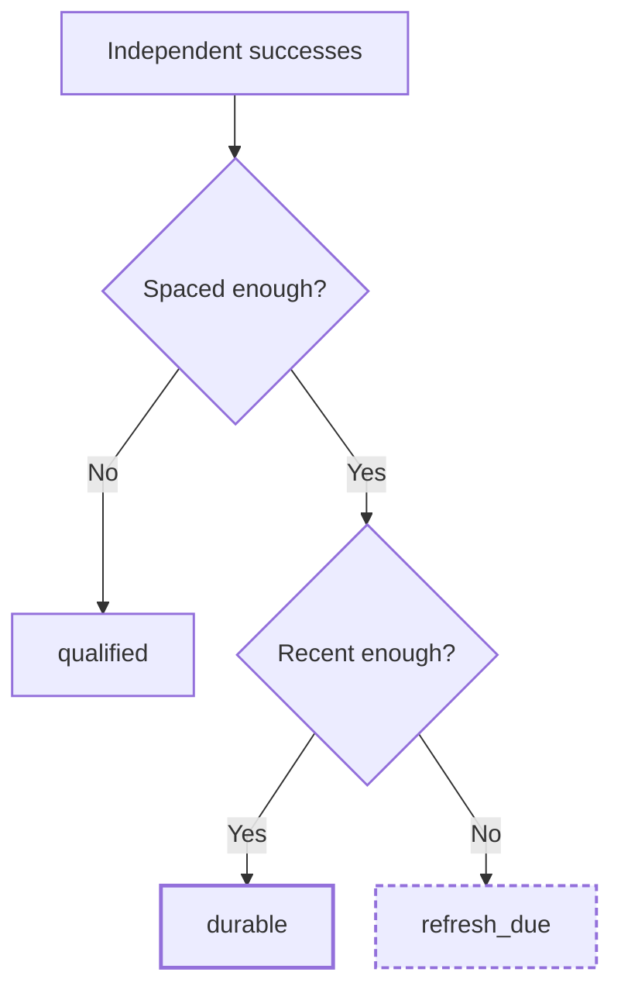

# Learning Evidence Core

A small deterministic Python module that keeps **assisted practice**, **independent evidence**, and **mastery state** separate.

**Assisted practice does not get a fake moustache and pass as independent evidence.**

This public sample comes from my private Learning OS work. It shows how recorded evidence determines a skill's current state. I can adapt the rules and build the surrounding learning applications, practice workflows, and progress tracking.

## Evidence: start with the attempts for one skill

Success must be correct and independent. Assisted attempts still count as practice, and evidence from another skill does not enter this calculation.

## Durability: count spaced successes, then check recency

The configured count and spacing determine durability. Once enough spaced successes exist, the latest correct independent success sets the refresh clock, including later successes that were not needed to establish durability.

## State rules

`mastery_for()` evaluates one skill at a time.

| Evidence seen | State |
|---|---|
| No attempts | `unseen` |
| Attempts, but no correct independent success | `practice` |
| At least one correct independent success | `qualified` |
| Enough counted independent successes with the configured spacing | `durable` |
| Durable evidence whose latest independent success is too old | `refresh_due` |

The defaults in `src/learning_evidence/mastery.py` are:

| Setting | Default |
|---|---:|
| `min_independent_successes` | 2 |
| `min_spacing` | 1 day |
| `refresh_after` | 30 days |

These are **configurable software rules, not scientifically validated universal thresholds for human learning**. Counted successes must satisfy the configured spacing. Once durability exists, a later correct independent success refreshes the recency clock even if durability had already been established.

Other enforced boundaries are deliberately boring:

- evidence is isolated by skill;
- `help_level > 0` remains practice evidence;
- assisted project completion does not auto-promote mastery;
- timestamps must be timezone-aware;
- nonsensical threshold values are rejected.

## Where the behavior lives

- [`src/learning_evidence/mastery.py`](src/learning_evidence/mastery.py) — state derivation, spacing, recency, and threshold validation
- [`src/learning_evidence/models.py`](src/learning_evidence/models.py) — attempts and evidence/mastery enums
- [`src/learning_evidence/evidence.py`](src/learning_evidence/evidence.py) — evidence classification and project-promotion boundary
- [`tests/test_core.py`](tests/test_core.py) and [`tests/test_mastery.py`](tests/test_mastery.py) — the state journey, spacing, refresh, and configuration checks

Verification commands and expected checks: [docs/verification.md](docs/verification.md).

## Public boundary

This repository is a public extraction of evidence/mastery rules from private Learning OS work. It intentionally excludes learner history, exercises, personal progress, UI state, recordings, and provider integrations. See [`PROVENANCE.md`](PROVENANCE.md) and [`SECURITY.md`](SECURITY.md) for those boundaries.
