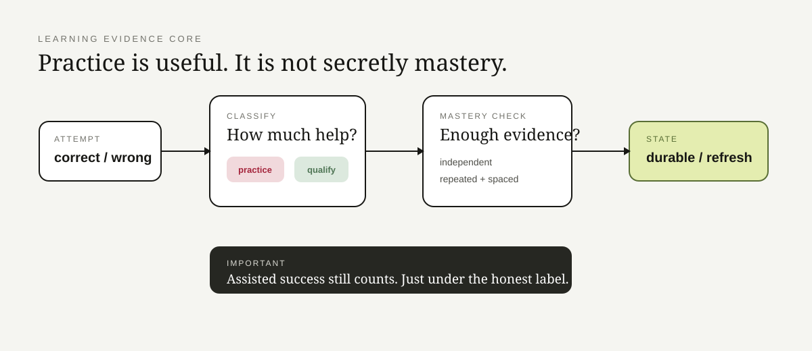

# Learning Evidence Core

**Watching three tutorials is not a black belt.**

This is the public evidence slice from my Learning OS work.

The core idea is deliberately unfancy: **helped practice is useful, but it is not the same evidence as independent performance.**

## What the system refuses to fake

A learner can:

- finish something with hints;
- finish a project with heavy help;
- answer correctly twice in five minutes;
- have genuinely learned something months ago and now need a refresh.

Those are different states.

The code keeps them different instead of pouring everything into one shiny “mastery score.”

## Repo map

| Area | Responsibility |
|---|---|
| `models.py` | attempts, evidence kind, mastery states |
| `evidence.py` | classify assisted vs independent evidence |
| `mastery.py` | repeated + spaced mastery logic |
| `core.py` | stable facade |
| `tests/` | evidence and retention behavior |
| `docs/` | design choices and workflow |

## Why I built it this way

A learning product can accidentally reward the dashboard instead of the learner.

If the system promotes every assisted success to “mastered,” the numbers improve while the learner's actual independence does not.

That is a very efficient way to build a beautiful lie.

The private Learning OS adds exercises, RS-1 decisions, C/Python/AI labs, persistence, and session planning. This repo keeps only the part that decides what the evidence actually means.

> XP is allowed to be fun. Evidence should still tell the truth.
